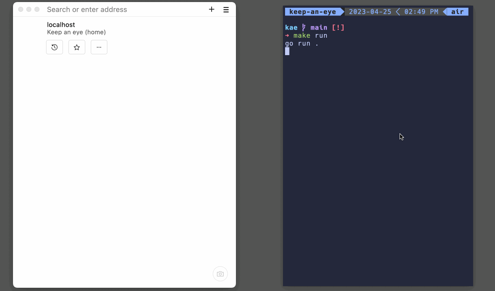

# keep an eye (kae)

A simple tool for keeping an eye on your processes.

This is poor man version of [deadmansnitch](https://deadmanssnitch.com/).



### What is the problem I was trying to solve?

I have quite a few processes that run periodically. I wanted to make sure those keep running and I want to
see, in a single place how those processes are doing.

You may be thinking, easy, use prometheus and alertmanager. That's an option but I think it has a higher operational
cost compared with this solution.

The idea is you create a token from the UI and select what is the expected heartbeat interval. The token will be
fired if you don't get a periodic heartbeat within the limits of the interval defined.

Let's say you have a process that backups your sqlite database to s3. And it is suppose to run every hour. You
can use kae to keep an eye on it:

1. create a token
2. After the process runs successfully, make a request to (https://kae/hb/token) where token is the 20 character token
   value.

The keep an eye on things from the console.

### Questions

**Why don't you report when a token gets fired via, let's say, email?**

I could but I don't want to be alerted, I just go regularly to the UI and check the status of things.
Maybe I will add that feature in the future.

### TODO

- [x] table token
- [x] table ping
- [x] change project name
- [x] endpoint /newtoken
- [x] GET endpoint /hb/<token>: update token ping store the value
- [x] background job to every minute check of heart beats
- [x] wire up option for disable token
- [x] wire up remove token
- [x] add description for token
- [x] add tests
- [x] add basic auth for certain routes
- [x] wire input arguments
- [x] production deployment
- [x] backup db
- [x] reload page when there are status updates
- [ ] write blog post
- [ ] show number of tokens firing
- [ ] copy to the clipboard token: https://stackoverflow.com/questions/63600367/copy-text-to-clipboard-using-html-button

## Preparing the tool for production

Let's assume you have an ubuntu box where you want to deploy this software.

The process should be:

1. Create a dedicated user/pass: `sudo useradd -rs /bin/false kae`
2. Inspect the Dockerfile and modify the execution (last line) as necessary.
3. Create the .env file to load necessary env files.
   Use a .env.prod that your deployment script will use when deploying to production.
4. Create data dir for the sqlite db file:

```
$ sudo mkdir /data/kae
$ sudo chown kae:kae /data/kae
```

5. Add .env\* to gitignore
6. Modify Makefile necessary targets (restart) to start binary correctly
7. `make main-linux-amd64 rsync` to build the target binary and rsync all the repo to the prod box.
8. ssh into the prod box
9. `make docker/build docker/run` to build and run the image. Make sure it runs correctly.
10. Update your webserver to map public domain traffic to your container. Maybe something like this in Caddy:

```
https://kae.yourdomain.net {
  reverse_proxy /* http://kae:20999
}
```

Notice that requires you having the proper dns setup (wildcard setup). Caddy will setup a new cert
for you on demand. Thank you Caddy.

11. Add a cronjob to run db backup script to s3

    - create s3 bucket
    - create kae new token
    - modify scripts/backup-kae-db.sh as necessary
    - run the script to make sure it creates the backup
    - add cronjob to run every hour: `10 * * * * /home/ubuntu/kae/scripts/backup-kae-db.sh`
    - Make a heartbeat request to restore the green in the token. Remember the background job runs every x seconds.

12. Finally, test `make deploy` to make sure you can deploy new releases easily. Enjoy!
